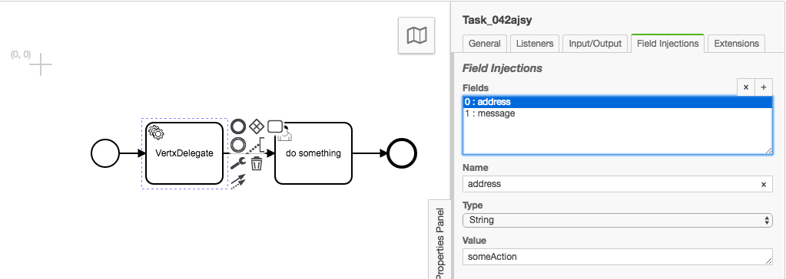

# Camunda BPM with Vert.x (Spring Boot + Camunda + Vert.x)

This is a working example/prototype/use case builder for testing the capabilities of using Vertx.io to extend CamundaBPM (Spring Boot Deployment).

## Why does this exist?

CamundaBPM provides a amazing BPM engine to orchestrate processes from, but there can be "annoyances" when working with Camunda as a "microserice": that is, you use Camunda as a common microservice rather than a "embedded BPM engine in your application".  This means that you would be interacting with Camunda through the Rest API, and as your API usage grows in complexity, there are limits to what the current Rest API offers.  Given that this is a "common microservice" (that may be used 'enterprise wide') we may or may not want to continually extend Camunda's core REST API.  So how do we add API functionality without having to recompile Camunda's Jar, and preferably, how can we add these API functions **without** having to write "Java".

Vertx to the rescue!  [Vertx.io](vertx.io) provides a Polyglot library on the JVM.  This lets us create a Spring Boot Camunda BPM application, and as part of that application, we will instantiate Vertx and deploy Vertx "Verticles".


# How to Build and Deploy

1. Root of Project and run: `./mvnw clean install`

1. After build is complete, run: `java -jar ./target/vertxcamunda-0.1.0-SNAPSHOT.jar`

Follow along in the Console, and you will see Netty boot, followed by CamundaBPM, followed by the Vertx Verticle.

Once you see the message: `Primary Javascript Vertx Verticle is Deployed` then you can navigate to: `http://localhost:8081/my-deployments` which should return a result such as:

```json
  [{
    "deployedArtifacts": null,
    "deployedCaseDefinitions": null,
    "deployedDecisionDefinitions": null,
    "deployedDecisionRequirementsDefinitions": null,
    "deployedProcessDefinitions": null,
    "deploymentTime": "Tue Apr 03 16:45:51 EDT 2018",
    "id": "ff48de6a-377f-11e8-95e6-60c547076970",
    "name": "vertxCamundaApplication",
    "new": false,
    "persistentState": "class org.camunda.bpm.engine.impl.persistence.entity.DeploymentEntity",
    "source": "process application",
    "tenantId": null,
    "validatingSchema": true
  }]
  ```

  You can extend the use case or add additional verticles by modifying the `myVerticle.js` file in `src/main/resources`


# TODO

1. Add Clustering Support
1. Add NPM project example showing how to build a NPM style project of JS verticles.
1. Add error handling to Vertx Delegate


# How does this all work? I am not quite sure what is going on...


# How to scale this thing

The Camunda SpringBoot will provide the standard camunda clustering capabilities.  This will allow you to deploy multiple instances of the Camunda SpringBoot application that point to a common database service.

Vertx can be clustered and scaled as well with all of the standard Vertx scaling features.  Multiple instances of stand-alone Vertx can be setup once you establish event bus endpoints that speak to Camunda's Java API.  

# Additional Scenarios to Test:

1. What are benefits of using Vertx vs Deploying Many Camunda instances that have been customized, and all instances point to same Camunda DB.
1. Add support for using es4x (https://github.com/reactiverse/es4x) so that "node" projects can be used to extend the Camunda BPM API.


# Vertx Camunda JavaDelegate

The Vertx delegate is a Camunda JavaDelegate that enables access to the Vertx EventBus.

using the Java Class: `io.digitalstate.vertxcamunda.VertxDelegate` you can then use Field Injection to provide a `address` (String) ad `message` (Currently String is only supported, but will be converted to JSON in future iterations) which will be used to communicate with the Event Bus.

This allows you to create javascript verticles that listen for eventbus actions that are activated by the Camunda Java Delegate.

Consider the following:

The `delegate-verticle.js` verticle is in `src/main/resources`.  This verticle contains the following:

```javascript
exports.vertxStart = function() {
  console.log('Camunda Delegate Verticle has Deployed')
}
exports.vertxStop = function() {
  console.log('Camunda Delegate Verticle has UnDeployed')
}

var eb = vertx.eventBus()
console.log(eb)

var consumer = eb.consumer("someAction")
consumer.handler(function (message) {
  console.log("I have received a message: " + message.body())
  console.log(message.headers().get('DelegateExecution'))
  message.reply("how interesting!")
})
```

The eventbus is establishing a consumer for the eventbus Address of `someAction`

You can then set your Service Task or any other delegate code as follows:





# camunda-services.js

The camunda-services.js library is a small set of code that exposes the Camunda engine services as variables.

You can load this in any javascript vertx verticle with `load('classpath:camunda-services')`.  See the [camunda-services.js](./src/main/resources/camunda-services.js) file for which variables are exposed.

# Sample BPMN File

The `sample.bpmn` BPMN file (`src/main/resources`) has been configured with a example of the [VertxDelegate](#vertx-camunda-javadelegate):


You can activate this process through the Task list (Default configuration of User: `admin` Password: `admin`).  Start the "Sample" process definition.

The console will print the following

```console
I have received a message: AWESOME!!!!
{"isCanceled":false,"activityInstanceId":"Task_042ajsy:9596ecb2-3c26-11e8-b22d-60c547076970","CurrentActivityName":"VertxDelegate","ProcessInstanceId":"9594a2c0-3c26-11e8-b22d-60c547076970","ParentActivityInstanceId":"9594a2c0-3c26-11e8-b22d-60c547076970","ProcessDefinitionId":"Sample:1:7b508b8f-3c26-11e8-b22d-60c547076970","CurrentActivityId":"Task_042ajsy","ExecutionId":"9594a2c0-3c26-11e8-b22d-60c547076970"}
EventBus SUCCESS: how interesting!
```